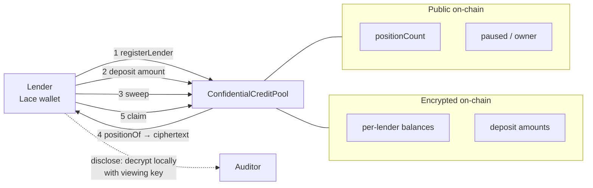

# DeFa × Midnight — Confidential Credit Pools

Private, composable credit positions on [Midnight](https://midnight.network). Built for the AKINDO WaveHack.

DeFa is an invoice-financing marketplace: lenders fund credit pools, borrowers draw liquidity against verified invoices, repayments settle back to lenders. On public chains this leaks the whole book — borrower identity, invoice amounts, lender allocations, business relationships. **Midnight lets those stay private on-chain while settlement stays auditable.** That is the entire point of this project.

## What Wave 1 delivers

A lender deposits into a DeFa credit pool and receives a **confidential position**: the amount and their identity are ElGamal-encrypted on-chain, while the pool's health stays public. They can claim liquidity back, and **disclose** their own position to an auditor in one click — without revealing anyone else's.



### Real vs simulated — stated plainly

Wave 1 is honest about its boundary, and the UI labels it everywhere:

| | Status |
|---|---|
| Confidential deposit → private position | **Real, on-chain** |
| Sweep, claim, selective disclosure | **Real, on-chain** |
| Public pool signals (`positionCount`) | **Real, on-chain** |
| Borrower side + yield **source** | **Simulated**, badged "Simulated · Wave-2" |

Exactly one pool (`ccp-live-01`) is wired to the deployed contract and badged **● Live on Midnight**. The other eleven render from `client/src/data/simulated-pools.json` as portfolio context.

## Waves plan

| Wave | Theme | Deliverable |
|------|-------|-------------|
| **1** | Confidential credit primitive | Lender privately deposits → receives a **private position**. Amount + identity hidden, pool total public, one-click auditor disclosure. Full React FE. |
| **2** | PayMate full flow | Real end-to-end capital cycle: deposit → pool funds a borrower → repayment → lender claim, confidential throughout. |
| **3** | Multi-pool / multi-lender | Many lenders, many pools, per-lender private positions, aggregate public analytics. |

### In prod-DeFa terms
The **confidential capital-in / private-position-out primitive** — the exact lender-privacy layer prod DeFa (Starknet-mainnet invoice financing) plugs in. The SME-verify → score → borrower-payout → repay → claim lifecycle is Wave 2/3.

## Architecture (Compact)

Midnight's model maps directly onto confidential credit:

- **Ledger** (public on-chain state) → pool total, pool status
- **Witness** (private off-chain state) → lender identity, individual amounts
- **`disclose()`** → native selective disclosure for auditors/regulators
- **OZ `ConfidentialFungibleToken`** → shielded position/deposit token (private balances + holders)
- **OZ `Ownable` / `Pausable`** → admin controls, mirroring the DeFa marketplace

> **Design note — no C2C yet.** Midnight does not (currently) support contract-to-contract token movement: a contract that *receives* an external token cannot send it back out. So the pool is modelled as a **token issuer** — it *mints* a confidential position token to the lender against a deposit (mint/burn + escrow), rather than custodying an external token. This shapes the whole contract design.

### The dual-balance gotcha

OpenZeppelin's `ConfidentialFungibleToken` is **dual-balance**. `deposit` → `_mint` credits a **pending** bucket (anti-grief: only the holder can move it into spendable), while `positionOf`/`balanceOf` read the **spendable** bucket. So a position reads zero until the holder calls **`sweep()`**.

The lender flow is therefore **deposit → sweep → positionOf(real) → claim**, and the UI runs all three behind one button. Both balances are encrypted; sweeping only reveals *that* a sweep happened — the same leak profile as the already-public `positionCount`.

`claim`/`_burn` calls `wit_PlaintextBalance(ct)` and ZK-verifies `Dec(ct) == plaintext`, so the wallet must cache its own spendable plaintext before claiming. An ElGamal position **cannot be decrypted back from chain** — the holder knows their balance only because they tracked it — so the client persists it per contract + wallet.

## Toolchain (verified working)

| Tool | Version | Notes |
|------|---------|-------|
| Compact compiler | **0.31.0** (pinned) | Newer compilers (0.33+ → language 0.25) break the templates/OZ. Pin with `compact update 0.31.0`. The `compact` CLI wrapper reports its own version (0.5.x) — not the same number. |
| OpenZeppelin Compact | v0.2.0 (npm) / v0.3.0-alpha (GitHub) | `ConfidentialFungibleToken` is only in the GitHub alpha — vendored under `contract/src/oz/`, not on npm yet. |
| Proof server | `midnightntwrk/proof-server:8.0.3` | Docker, `:6300`. Generates ZK proofs; required by CLI + UI. |
| Node | `midnightntwrk/midnight-node:0.22.3` | Docker, `:9944`, `CFG_PRESET=dev` (genesis-funded — no faucet needed locally). |
| Indexer | `midnightntwrk/indexer-standalone:4.0.1` | Docker, `:8088`. |
| Wallet | Lace (Midnight network) | For preprod: faucet tNIGHT → generate tDUST for fees. |
| Node.js | 24.x | `ts-node`'s ESM loader is broken on 24 — use `npx tsx`. |

## Layout

```
contract/         Compact contract (ConfidentialCreditPool.compact, 10 circuits) + vendored OZ
api/              ConfidentialCreditPoolAPI — deploy/join, typed circuit wrappers, state$ observable
client/           React FE (Vite) — the DeFa Arc lender UI, wired to Midnight via Lace
bboard-cli/       deploy + E2E CLI, standalone-stack compose
bboard-ui/        upstream template UI (reference only — not the shipped FE)
contract-probes/  stack-gate experiments (MiniPool.compact — OZ import + compile proof)
```

## Quickstart

Prereqs: **Node 24** and **Docker**. The compiled ZK artifacts are committed, so the `compact` compiler is only needed if you change the contract.

```bash
npm install
npm run demo
```

`npm run demo` brings up a local standalone Midnight stack (node `:9944`, indexer `:8088`, proof server `:6300`), starts the **local dev wallet** on `:5301` — it syncs the chain's pre-funded account and deploys a pool it owns — and serves the portal at **http://127.0.0.1:5201**. First start takes a few minutes.

Then, in the portal:

1. **Use local dev wallet** → **Pools** → the **● Live on Midnight** pool.
2. **Deposit confidentially** — register → deposit → sweep, each a real ZK-proven transaction (a few minutes of proving on a laptop).
3. **Disclose position** — decrypts your own position; the chain only ever holds the ciphertext.
4. **Accrue** (admin, simulated yield source) and **Claim** — both real transactions; each success toast shows the tx hash.

`tail -f bboard-cli/dev-wallet.log` prints every transaction hash and block as it lands. Just want to look around? **Browse pools without a wallet** is read-only.

### Why a dev wallet and not Lace

Lace connects to this stack, but every transaction needs DUST for fees, and DUST registration wasn't available in the Lace build we had. The dev wallet (`bboard-cli/src/dev-wallet-server.ts`) holds the local chain's genesis-funded account and runs the same action sequence as the Lace path (`client/src/midnight/client.js`). **Connect Lace** is still wired for when fees are available.

> **Troubleshooting.** ZK proofs need memory — on a 16 GB machine, close other heavy apps first. If a deploy hangs, the persisted local chain may be corrupt: `cd bboard-cli && docker compose -f compose-standalone.yml down -v`, then `npm run demo` again. Stop the dev wallet with `pkill -f dev-wallet-server.ts`.

<details>
<summary>Manual steps (what <code>npm run demo</code> does)</summary>

```bash
cd bboard-cli && docker compose -f compose-standalone.yml up -d
npx tsx src/dev-wallet-server.ts        # writes client/.env.local when ready
cd ../client && npm run dev -- --port 5201 --host 127.0.0.1
```

To recompile after changing the contract: `compact update 0.31.0`, then `cd contract && npm run compact`.

</details>

## Tests

```bash
cd bboard-cli && npx tsx src/e2e-ccp.ts
```

Deploys a fresh pool and replays the **exact action sequence the UI runs**, asserting against the public ledger and the encrypted ciphertext rather than UI state:

```
18/18 checks passed
E2E OK — invest → sweep → disclose → claim, verified on-chain
```

It covers deposit→PENDING, sweep→SPENDABLE, `positionCount` incrementing on-chain, disclosure, claim changing the ciphertext, the privacy invariant, a repeat deposit by the same lender, and owner-gated confidential yield accrual.

**Scope:** contract + API + action layer. The in-portal flow (dev wallet → deposit → disclose → accrue → claim) was verified by hand in a browser; the Lace connector is not covered.

## Status

- ✅ **Contract** — `ConfidentialCreditPool.compact`, 10 circuits, compiles to ZK artifacts
- ✅ **API** — `ConfidentialCreditPoolAPI` (deploy/join, typed wrappers, `state$`)
- ✅ **FE** — DeFa Arc lender UI on Vite, live pool wired
- ✅ **In-portal transactions** — invest / disclose / accrue / claim via the local dev wallet, real txs on a local Midnight node
- ✅ **E2E** — 18/18 on a real chain
- ⏳ **Lace transactions** — wired; blocked on DUST fee registration in Lace
- ⏳ **Preprod deploy** for public explorer links — gated on tDUST
- ⏳ Demo video + submission

---

Scaffolded from [midnightntwrk/example-bboard](https://github.com/midnightntwrk/example-bboard) (Apache-2.0, see `LICENSE`).
